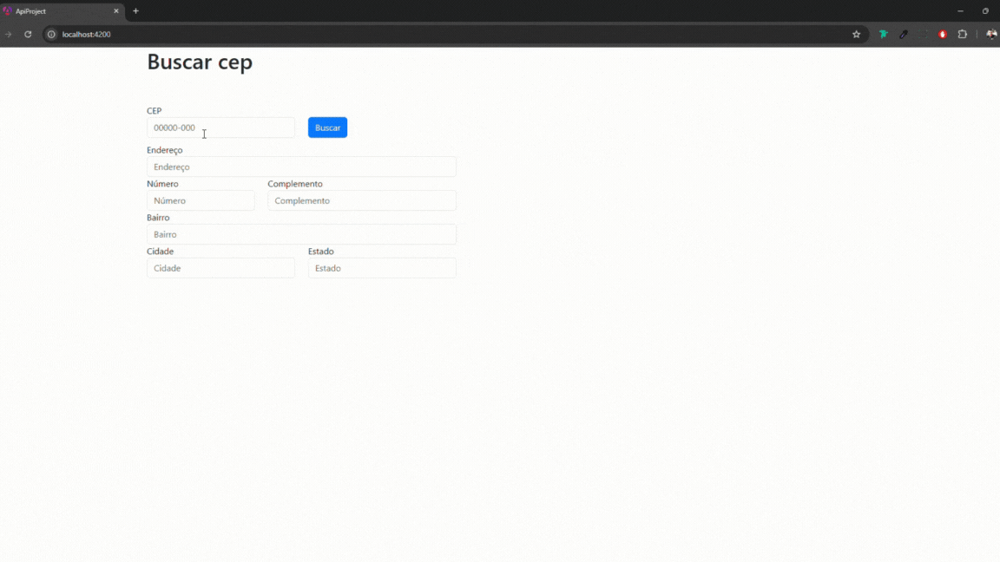

<!DOCTYPE html>
<html lang="pt-BR">
<head>
  <meta charset="UTF-8">
  <meta name="viewport" content="width=device-width, initial-scale=1.0">
  <title>Consulta de CEP com Angular</title>
</head>
<body>
  <h1>Consulta de CEP com Angular</h1>
  

    Este projeto é uma aplicação Angular que consome a API 
    <a href="https://viacep.com.br" target="_blank">ViaCEP</a> para buscar dados de endereços a partir de um CEP informado.
    A aplicação permite ao usuário preencher o CEP em um campo de texto e, ao buscar, os outros campos do endereço, 
    como logradouro, bairro, cidade e estado, são preenchidos automaticamente.
  

  
  

  <h2>Demonstração</h2>
  

   
  

  
  

  <h2>Funcionalidades</h2>
  <ul>
    <li>Permite ao usuário inserir um CEP.</li>
    <li>Faz a busca na API ViaCEP.</li>
    <li>Preenche automaticamente os campos do formulário com os dados retornados pela API.</li>
  </ul>
  
  

  <h2>Tecnologias Utilizadas</h2>
  <ul>
    <li><strong>Angular</strong></li>
    <li><strong>TypeScript</strong></li>
    <li><strong>Bootstrap</strong></li>
  </ul>
  
  

  <h2>Como Executar o Projeto</h2>
  <h3>1. Clonar o Repositório</h3>
  <pre>
    <code>
git clone https://github.com/seu-usuario/seu-repositorio.git
cd nome-do-projeto
    </code>
  </pre>

  <h3>2. Instalar Dependências</h3>
  
Inicie e instale as dependências do projeto com o comando:

    <pre>
    <code>
npm init -y
    </code>
  </pre>

  <pre>
    <code>
npm install
    </code>
  </pre>

  <h3>3. Executar a Aplicação</h3>
  
Inicie o servidor de desenvolvimento com:

  <pre>
    <code>
ng serve
    </code>
  </pre>
  
Acesse no navegador: <a href="http://localhost:4200" target="_blank">http://localhost:4200</a>.

  
  

  <h2>API Utilizada</h2>
  

    A aplicação utiliza a API pública <a href="https://viacep.com.br" target="_blank">ViaCEP</a> para obter informações de endereço com base no CEP.
    A API retorna os seguintes dados:
  

  <ul>
    <li>CEP</li>
    <li>Logradouro</li>
    <li>Complemento</li>
    <li>Bairro</li>
    <li>Localidade (Cidade)</li>
    <li>UF (Estado)</li>
  </ul>
</body>
</html>
